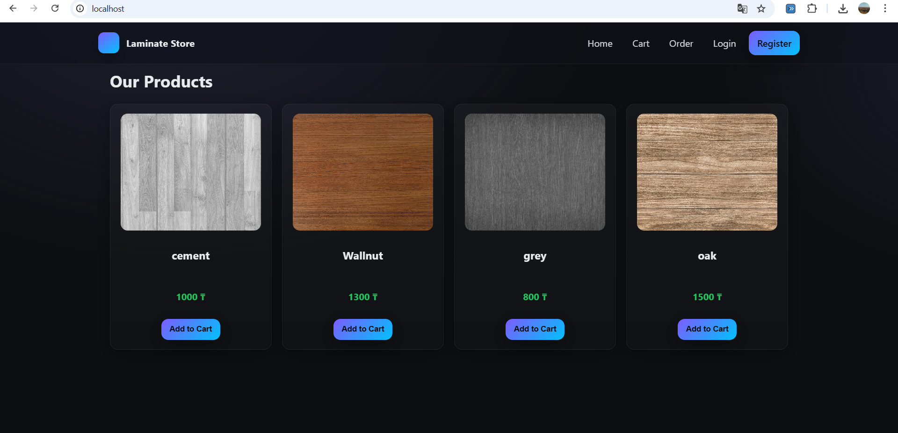
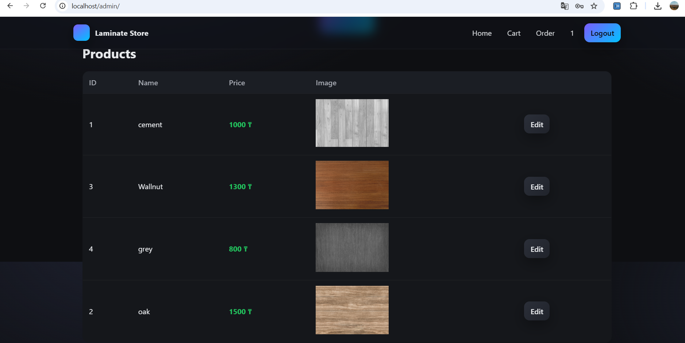
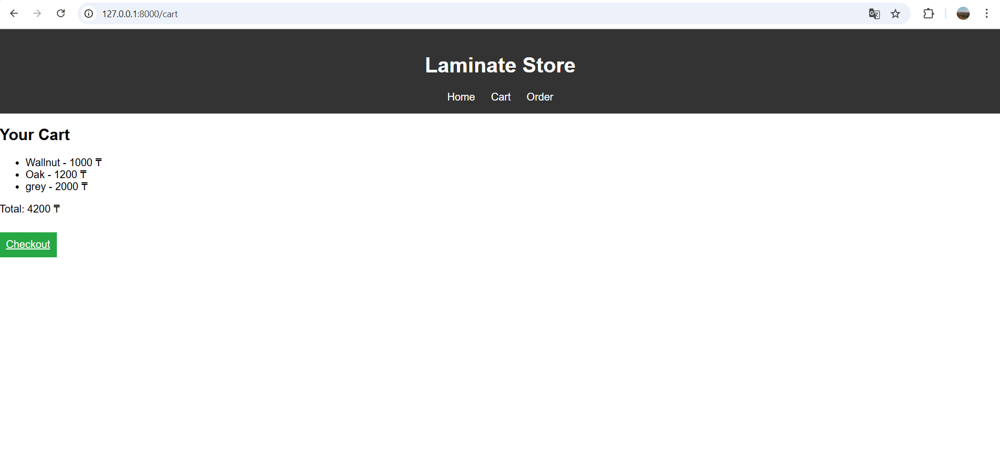

# Laminate Store 🛒

Полноценный интернет-магазин ламината с авторизацией, корзиной и админ панелью.

---

## 🚀 Функционал

- Регистрация и авторизация пользователей (JWT)
- Каталог товаров с фотографиями
- Корзина и оформление заказов
- Админ панель для управления товарами
- Миграции базы данных через Alembic
- Кэширование через Redis

---

## 🛠️ Технологии

- **Backend:** FastAPI, SQLAlchemy, Alembic
- **Frontend:** HTML, CSS, JavaScript, Jinja2
- **Database:** PostgreSQL
- **Cache:** Redis
- **Auth:** JWT токены
- **Deploy:** Docker, Docker Compose, Nginx

---

## 📂 Структура проекта
```
laminate_store/
├── main.py                    # FastAPI entry point
├── database.py                # Подключение к БД
├── auth_utils.py              # JWT авторизация
├── middleware.py              # Middleware
│
├── routers/                   # Роуты
│   ├── admin.py               # Админ эндпоинты
│   ├── auth.py                # Авторизация
│   ├── cart.py                # Корзина
│   ├── order.py               # Заказы
│   └── product.py             # Товары
│
├── templates/                 # Jinja2 шаблоны
│   ├── base.html
│   ├── index.html
│   ├── admin.html
│   ├── cart.html
│   ├── login.html
│   ├── register.html
│   └── profile.html
│
├── static/                    # CSS, JS
├── alembic/                   # Миграции БД
├── uploads/                   # Фото товаров
│
└── deployment/
    ├── docker/
    │   ├── Dockerfile
    │   ├── docker-compose.yml
    │   └── requirements.txt
    └── nginx/
        ├── nginx.conf
        └── conf.d/fastapi.conf
```
---

## 🐳 Запуск через Docker

```bash
git clone https://github.com/Kazakbay/laminate_store.git
cd laminate_store/deployment/docker
docker-compose up --build
```

Открой http://localhost

---

## 📸 Скриншоты



